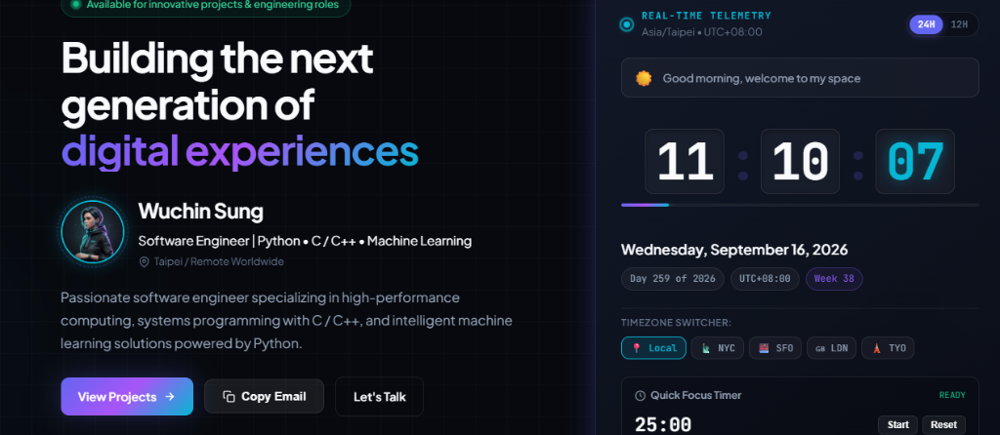

# Wuchin.dev — Personal Page & Interactive Portfolio Hub

> Modern, zero-dependency personal developer portfolio and real-time telemetry hub engineered with high-tech glassmorphic aesthetics, fluid micro-interactions, and live interactive simulations.

[](http://localhost:3000)
[](#-technologies-used)
[](LICENSE)
[](https://github.com/wujin57)

---

## 📸 Demo Snapshot



---

## 👤 Profile & About

* **Developer**: **Wuchin Sung**
* **Role**: Software Engineer
* **Core Focus**: **Python** • **C / C++** • **Machine Learning**
* **Location**: Taipei / Remote Worldwide
* **Email**: [wujin910504@gmail.com](mailto:wujin910504@gmail.com)
* **GitHub**: [https://github.com/wujin57](https://github.com/wujin57)

---

## 🚀 Key Features

* 💎 **Neo-Glassmorphic UI Design**:
  * Curated dark obsidian palette with multi-layer background blur (`backdrop-filter`).
  * Ambient glowing spheres, responsive fluid layouts, and smooth CSS micro-interactions.
  * Native Dark / Light mode instant toggle with persistence.

* ⏱️ **Real-Time Telemetry Clock & Time Hub**:
  * Live-updating digital clock with 24-hour and 12-hour format switching.
  * Multi-region timezone switcher (Local, New York, San Francisco, London, Tokyo).
  * Dynamic date indicators: Day of Year, UTC Offset, Week Number, and second-by-second progress gauge.
  * Integrated **Quick Focus Timer** (Pomodoro mode) with start/reset controls.

* 🧠 **Technical Skill Matrix**:
  * **Machine Learning & AI**: Deep Learning, PyTorch, TensorFlow, Scikit-Learn, Computer Vision, NLP / LLMs, Model Optimization.
  * **Systems & C / C++**: C, C++, Modern C++ (17/20), Data Structures, Multithreading, Memory Management, Algorithms, STL.
  * **Python Ecosystem**: NumPy, Pandas, FastAPI / Flask, Asyncio, SciPy & Matplotlib, Data Pipelines, Automation.
  * **Tooling & Architecture**: Git / GitHub, Linux Shell / Bash, CMake / Make, Docker Containers, SQL & PostgreSQL, GDB / Profiling, CI/CD Automation.

* 💻 **Interactive Code Terminal**:
  * Simulated developer environment displaying `developer.config.py` in native Python syntax highlighting.

* 📂 **Featured Projects Showcase**:
  * **Personal Page & Portfolio Hub**: Flagship zero-dependency portfolio with linked GitHub repository and architecture inspector.
  * Filterable project categories: *Personal Page*, *Machine Learning*, and *C / C++ & Systems*.
  * **Interactive Preview Modals**: Live sandboxes simulating cluster health checks, CRDT collaborative sync, and CSS glass token customization.

* ⚙️ **In-Browser Profile Customizer**:
  * Interactive modal allowing real-time personalization of the developer's name, title, bio, and contact information without touching code.

---

## 🛠️ Technologies Used

| Layer | Technologies |
| :--- | :--- |
| **Structure** | Semantic HTML5, SVG Icons |
| **Styling** | Vanilla CSS3 (Custom Properties, Flexbox, CSS Grid, Glassmorphism) |
| **Logic** | Vanilla JavaScript (ES6+, DOM APIs, LocalStorage, Intl.DateTimeFormat) |
| **Typography** | [JetBrains Mono](https://fonts.google.com/specimen/JetBrains+Mono), [Plus Jakarta Sans](https://fonts.google.com/specimen/Plus+Jakarta+Sans) |
| **Tooling** | Git, GitHub |

---

## 💻 Running Locally

This project requires **no external dependencies or build steps**. You can preview it immediately using any of the following methods:

### Option 1: Python Built-in Server (Recommended)
```bash
# In the project directory:
python -m http.server 3000
```
Open [http://localhost:3000](http://localhost:3000) in your web browser.

### Option 2: VS Code Live Server
1. Open the project folder in **VS Code**.
2. Right-click `index.html` and select **"Open with Live Server"** (or click **"Go Live"** in the bottom status bar).
3. The browser will automatically open `http://127.0.0.1:5500`.

### Option 3: Direct File Opening
Double-click `index.html` in your file explorer, or open in any modern browser:
```text
file:///path/to/0916/index.html
```

---

## 📁 Project Structure

```text
0916/
├── assets/
│   ├── avatar.jpg      # Developer portrait
│   └── demo.png        # Portfolio preview snapshot
├── app.js              # Application core logic, clocks, timers & simulation modals
├── index.html          # Semantic HTML5 structure & content
├── style.css           # Neo-glassmorphic styling & design system tokens
└── README.md           # Project documentation & overview
```

---

## 📬 Contact & Connect

* **Author**: Wuchin Sung
* **Email**: [wujin910504@gmail.com](mailto:wujin910504@gmail.com)
* **GitHub**: [@wujin57](https://github.com/wujin57)
* **Repository**: [https://github.com/wujin57/0916_personal_page_create](https://github.com/wujin57/0916_personal_page_create)

---
*Crafted with precision, zero bloat, and pure web standards.*
